# Exercise 1

Files created for this assessment:

- [my_cave_4x4.yaml](../docs_from_teacher/config/my_cave_4x4.yaml)

## New map - easy level

Run with

```sh
 # go to folder with the scripts
cd docs_from_teacher

# run scripts with new cave config

## Load visual map first
uv run 01_wumpus_world.py --config config/my_cave_4x4_easier.yaml

## Test agents against  new map 
uv run 02_simple_reflex_agent.py --config config/my_cave_4x4_easier.yaml --delay 0.5

uv run 03_model_based_agent.py --config config/my_cave_4x4_easier.yaml --delay 0.5

uv run 04_goal_based_agent.py --config config/my_cave_4x4_easier.yaml --delay 0.5

uv run 05_utility_based_agent.py --config config/my_cave_4x4_easier.yaml --delay 0.5

uv run 06_learning_agent.py --episodes 1500 --config config/my_cave_4x4_easier.yaml --delay 0.5

## Fast results
uv run 02_simple_reflex_agent.py --config config/my_cave_4x4_easier.yaml --quiet && \
uv run 03_model_based_agent.py --config config/my_cave_4x4_easier.yaml --quiet && \
uv run 04_goal_based_agent.py --config config/my_cave_4x4_easier.yaml --quiet && \
uv run 05_utility_based_agent.py --config config/my_cave_4x4_easier.yaml --quiet && \
uv run 06_learning_agent.py --episodes 1500 --config config/my_cave_4x4_easier.yaml --quiet;
```

### Evidences

screenshots after running the agents against new map

#### Simple reflex agent


- it moved forward and made some advances once faced the first pit in first raw
- but when faced a second pit it made a left turn
- it made it again until [1,4] but if got stuck there turning right

#### Model based agent

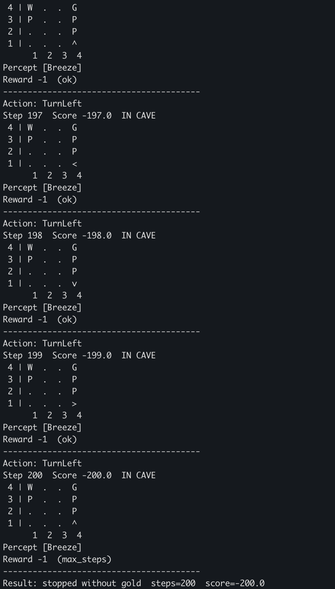

- it happened the same as in Simple Reflect agent
- but gut stuck in a loop turning to the left

#### Goal based agent

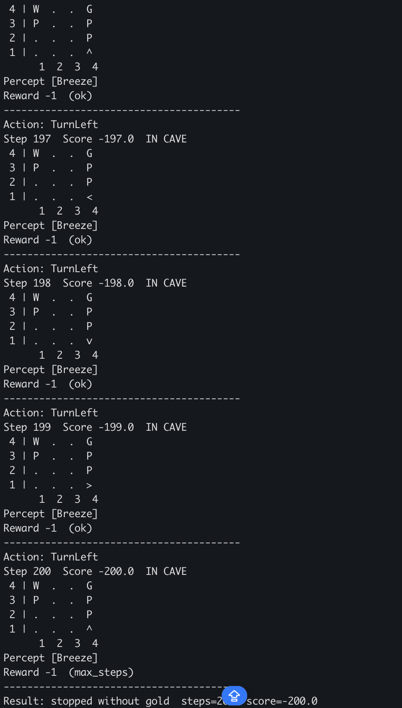

- It tried to move forward
- Then going up in the map
- but it ended stuck as in Model based agent

#### Utility based agent

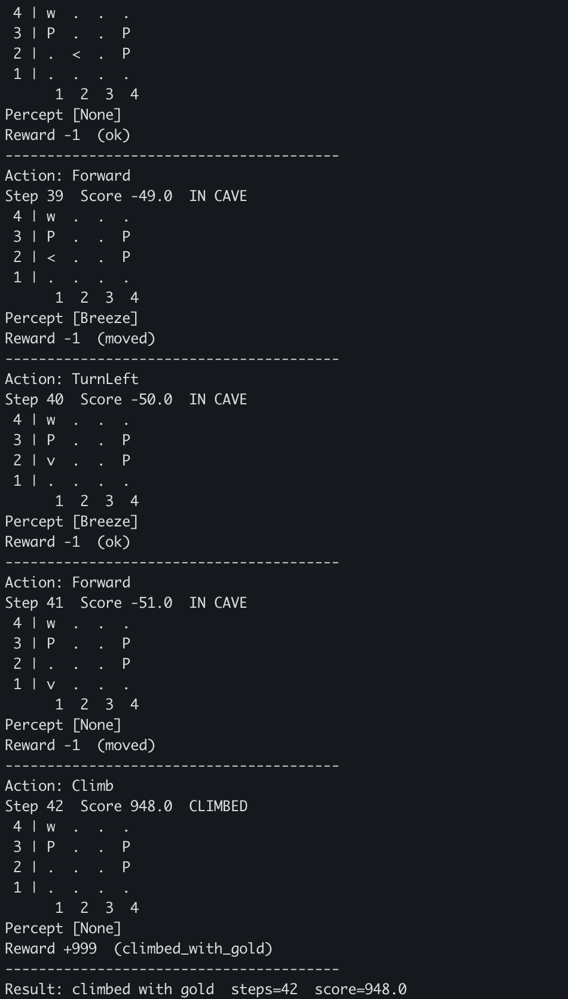

- It got the gold
- And killed the wumpus
- it got a higher score in point even than in easier maps, I assume due to the path was shorter this time, because there was no pit in the fat right side of the map, but there was the Wumpus which was killed

#### Learning agent


- It made nothing

## New map - mid level

Run with

```sh
 # go to folder with the scripts
cd docs_from_teacher

# run scripts with new cave config

## Load visual map first
uv run 01_wumpus_world.py --config config/my_cave_4x4_mid.yaml

## Test agents against  new map 
uv run 02_simple_reflex_agent.py --config config/my_cave_4x4_mid.yaml --delay 1.5

uv run 03_model_based_agent.py --config config/my_cave_4x4_mid.yaml --delay 1.5

uv run 04_goal_based_agent.py --config config/my_cave_4x4_mid.yaml --delay 1.5

uv run 05_utility_based_agent.py --config config/my_cave_4x4_mid.yaml --delay 1.5

uv run 06_learning_agent.py --episodes 1500 --config config/my_cave_4x4_mid.yaml --delay 1.5
```

Description of how `my_cave_4x4_mid.md` looks at the beginning

```sh
 4 | W  .  .  G
 3 | .  P  .  P
 2 | .  .  .  .
 1 | >  .  P  .
     1  2  3  4
```

- I put a pit close to the start position
- I put a pit close to the Gold
- And the wumpus and gold in the same row but in each edge

### Evidences

screenshots after running the agents against new map

#### Simple reflex agent

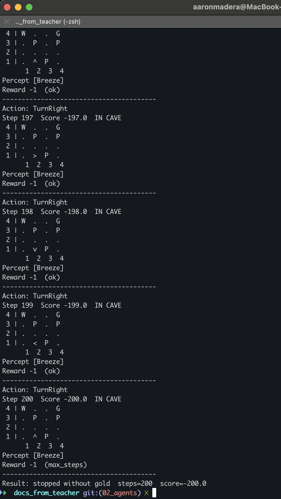

- The agent first move 1 step forward
- This time the agent got stuck in the same position
- It was stuck into a "turn right" loop, because it felt the breeze
- Script ended until agent reached the max allowed steps

#### Model based agent

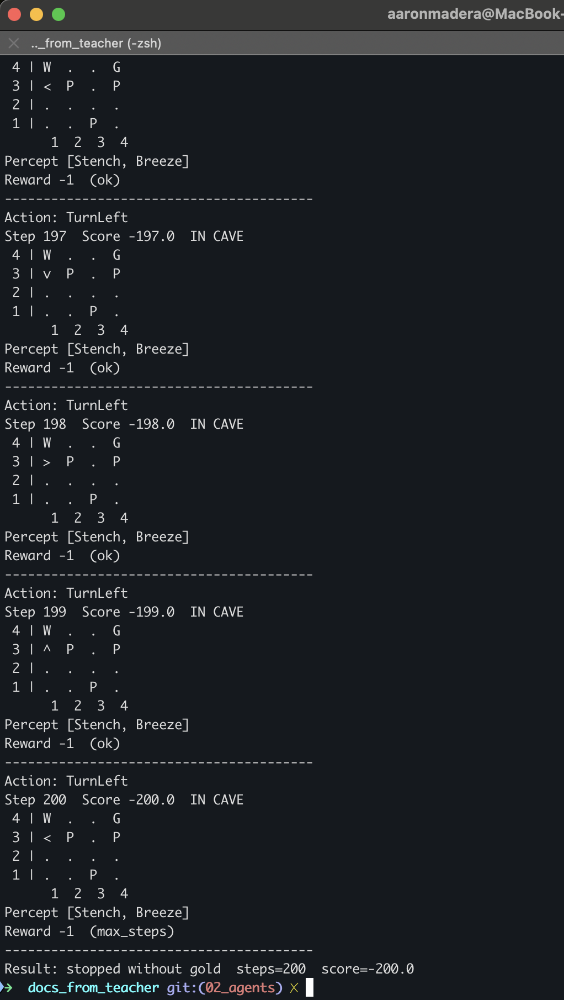

- First, the agent was able to move across the map, but it got stuck in a certain position, between the Wumpus and a pit
For this model the agent also got stuck in the same position
- It was stuck into a "turn left" loop, because it felt the breeze
- Script ended until agent reached the max allowed steps

#### Goal based agent

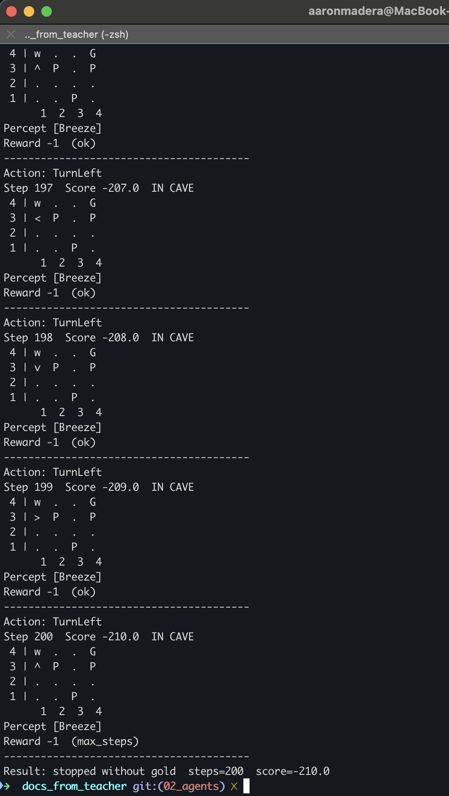

- It got stuck in the same position as previous agent, but it killed the Wumpus
- First, the agent was able to move across the map, but it got stuck in a certain position, between the Wumpus and a pit
For this model the agent also got stuck in the same position
- It was stuck into a "turn left" loop, because it felt the breeze
- Script ended until agent reached the max allowed steps

#### Utility based agent

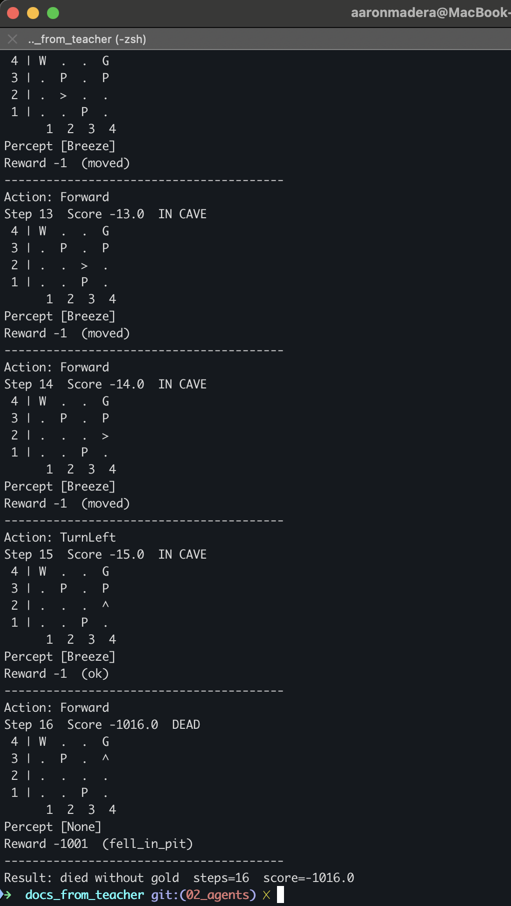

- It was able to pass in the sides of the pits
- When faced the Wumpus it returned
- It fell into a Pit and script ends after it

#### Learning agent

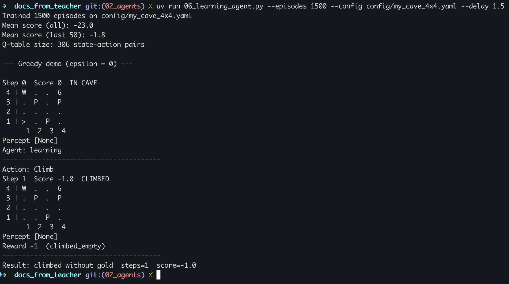

- It didn't get the gold
- Neither killed the Wumpus

## New map - hard level

Run with

```sh
 # go to folder with the scripts
cd docs_from_teacher

# run scripts with new cave config

## Load visual map first
uv run 01_wumpus_world.py --config config/my_cave_4x4_harder.yaml

## Test agents against  new map 
uv run 02_simple_reflex_agent.py --config config/my_cave_4x4_harder.yaml --delay 0.3

uv run 03_model_based_agent.py --config config/my_cave_4x4_harder.yaml --delay 0.3

uv run 04_goal_based_agent.py --config config/my_cave_4x4_harder.yaml --delay 0.3

uv run 05_utility_based_agent.py --config config/my_cave_4x4_harder.yaml --delay 0.3

uv run 06_learning_agent.py --episodes 1500 --config config/my_cave_4x4_harder.yaml --delay 0.3

## Fast results
uv run 02_simple_reflex_agent.py --config config/my_cave_4x4_harder.yaml --quiet && \
uv run 03_model_based_agent.py --config config/my_cave_4x4_harder.yaml --quiet && \
uv run 04_goal_based_agent.py --config config/my_cave_4x4_harder.yaml --quiet && \
uv run 05_utility_based_agent.py --config config/my_cave_4x4_harder.yaml --quiet && \
uv run 06_learning_agent.py --episodes 1500 --config config/my_cave_4x4_harder.yaml --quiet;
```

Description of how `my_cave_4x4_harder.md` looks at the beginning

```sh
 4 | P  .  P  G
 3 | .  P  .  W
 2 | .  .  .  .
 1 | >  .  .  .
     1  2  3  4
```

- I put the Wumpus protecting unique access to the Gold

### Evidences

screenshots after running the agents against new map

#### Simple reflex agent

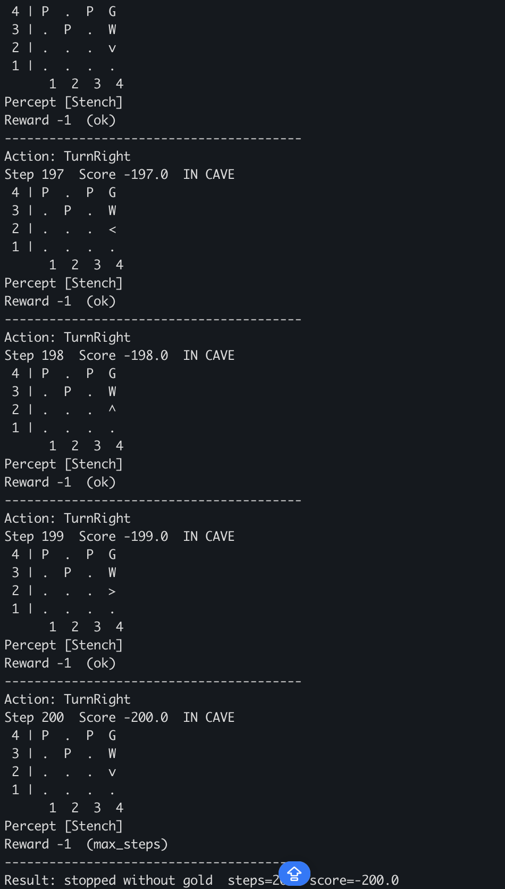

- The agent moved until close to the Wumpus
- It didn't kill it
- It got stuck there

#### Model based agent

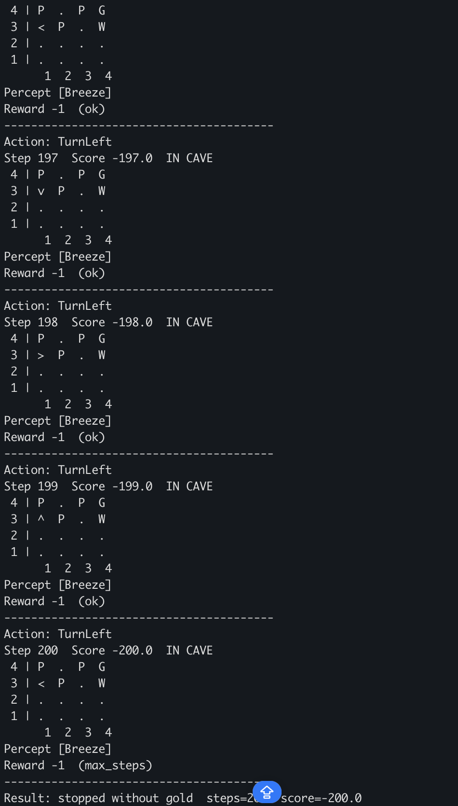

- It moved forward to the left
- Then went to the upper part of the map
- when faced the wumpus it went to the other side of the map
- it got stuck below the up-left corner where there is a pit

#### Goal based agent

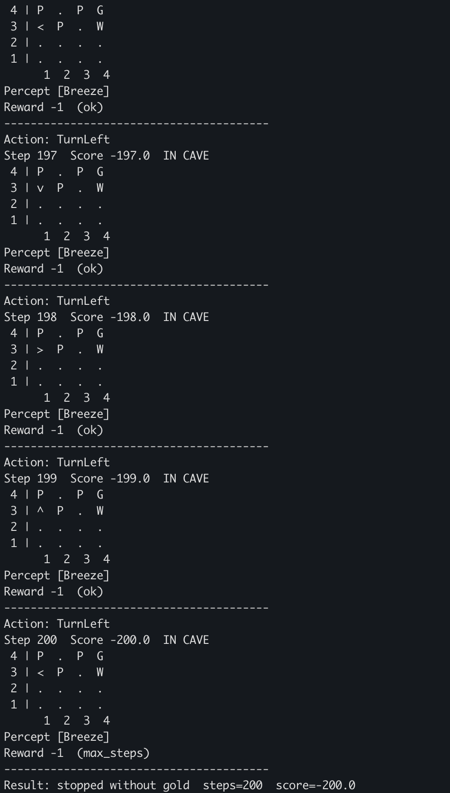

- It had same behavior as Model based agent

#### Utility based agent

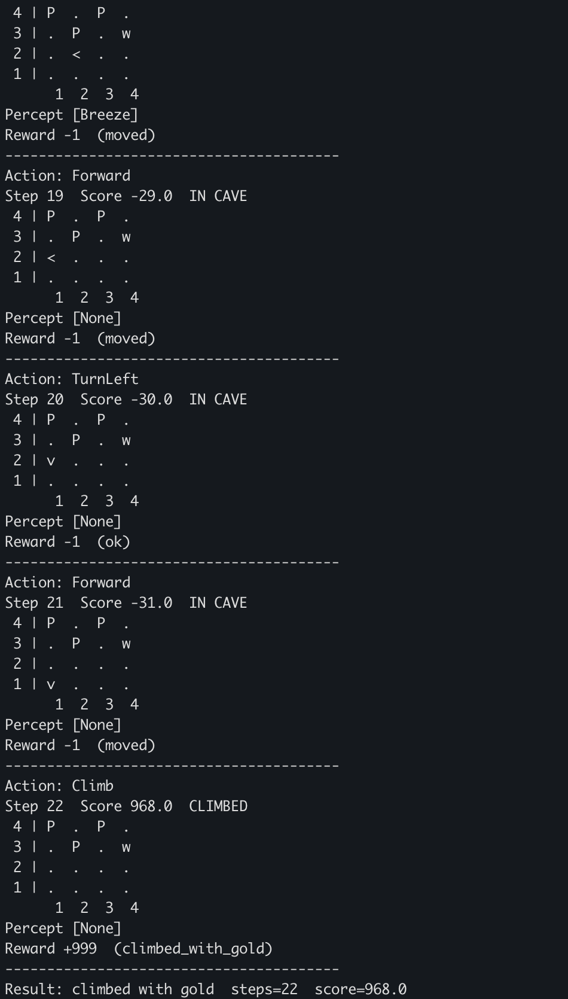

- It killed the Wumpus
- It caught the gold
- and it finished successfully

#### Learning agent

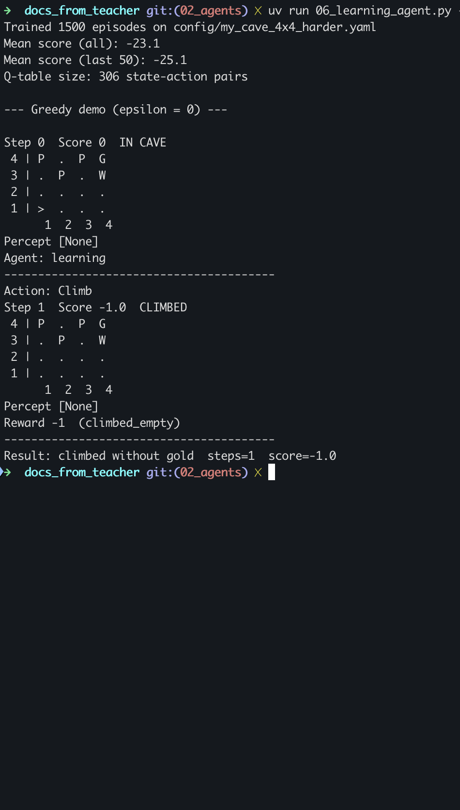

- It climbed empty
