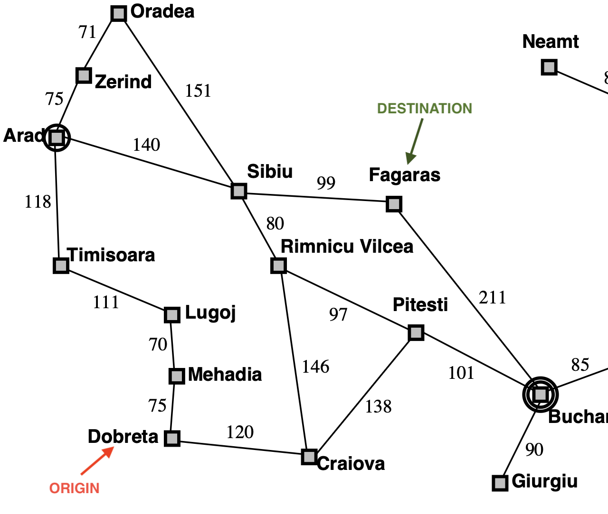
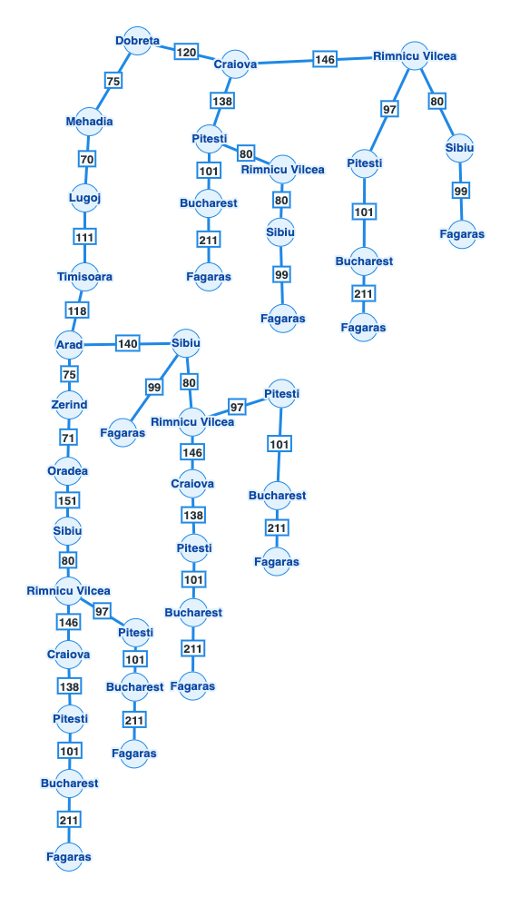

# Uninformed search

Results after running the five methods

## Selected pair of origen-destination

I selected:

- Drobeta -> Fagaras

<!-- Using HTML to prevent from displaying full width -->


Graph of possible paths to follow (created with: <https://graphonline.top/#>):



## Breadth First Search

command:

```python
uv run 02_breadth_first_search.py --from-city Drobeta --to Fagaras
```

Results:

```sh
Algorithm: Breadth-first search
Problem:   Drobeta → Fagaras
Status:    success
Path:      Drobeta → Craiova → Pitesti → Bucharest → Fagaras
Depth:     4 roads
Cost:      570 km
Expanded:  7 nodes
Generated: 17 nodes
```

## Uniform Cost Search

command:

```python
uv run 03_uniform_cost_search.py --from-city Drobeta --to Fagaras
```

Results:

```sh
Algorithm: Uniform-cost search
Problem:   Drobeta → Fagaras
Status:    success
Path:      Drobeta → Craiova → Rimnicu Vilcea → Sibiu → Fagaras
Depth:     4 roads
Cost:      445 km
Expanded:  11 nodes
Generated: 32 nodes
Frontier:  max size 6
```

## Depth First Search

command:

```python
uv run 04_depth_first_search.py --from-city Drobeta --to Fagaras
```

Results:

```sh
Algorithm: Depth-first search
Problem:   Drobeta → Fagaras
Status:    success
Path:      Drobeta → Craiova → Pitesti → Bucharest → Fagaras
Depth:     4 roads
Cost:      570 km
Expanded:  4 nodes
Generated: 13 nodes
Frontier:  max size 5
```

## Depth First Limited Search (limit 2)

command:

```python
uv run 05_depth_limited_search.py --from-city Drobeta --to Fagaras --limit 2
```

Results:

```sh
Algorithm: Depth-limited search
Problem:   Drobeta → Fagaras
Status:    cutoff
Detail:    limit=2
Expanded:  3 nodes
Generated: 8 nodes
Frontier:  max size 5
```

## Depth First Limited Search (limit 4)

command:

```python
uv run 05_depth_limited_search.py --from-city Drobeta --to Fagaras --limit 4
```

Results:

```sh
Algorithm: Depth-limited search
Problem:   Drobeta → Fagaras
Status:    success
Detail:    limit=4
Path:      Drobeta → Craiova → Pitesti → Bucharest → Fagaras
Depth:     4 roads
Cost:      570 km
Expanded:  4 nodes
Generated: 6 nodes
Frontier:  max size 8
```

## Iterative Deepening Search

command:

```python
uv run 06_iterative_deepening_search.py --from-city Drobeta --to Fagaras
```

Results:

```sh
Algorithm: Iterative deepening search
Problem:   Drobeta → Fagaras
Status:    success
Detail:    last_limit=4
Path:      Drobeta → Craiova → Pitesti → Bucharest → Fagaras
Depth:     4 roads
Cost:      570 km
Expanded:  14 nodes
Generated: 34 nodes
Frontier:  max size 8
```

## Analysis

- **Did `Breadth First Search (BFS)` find the path with less "roads/paths"?**

    Yes matter of fact, all of the methods found 4 paths, excluding UCS
  - **Is `Uniform Cost Search (UCS)` the one with less kms?**

    Yes, it is the one with less km in its results
- **Why can `Depth First Search (DFS)` return a longer path even when graph is the same?**

   (TO-DO) I think because it sort the names alphabetically
- **With which `--limit` `Depth First Limited Search (DLS)` passed from `cutoff` to solution?**

    It needed `4`
  - **And How that is related with path deepness of BFS/IDS (Iterative Deepening Search)?**
     
    (TO-DO)
