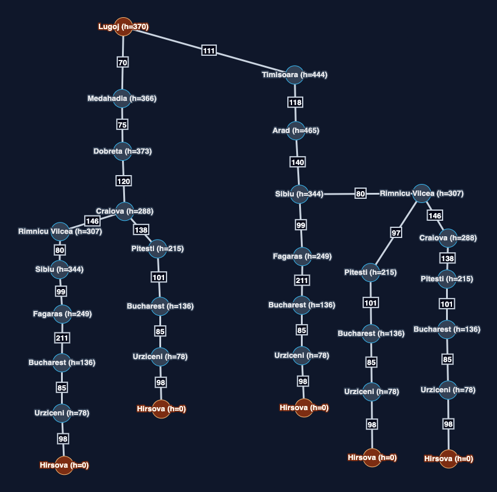

# Exercise 1

Results after running scripts for this exercise

## Selected pair of origin destination

- Lugoj → Hirsova

Graph with possible paths from Strt to goal. Vertex are joint with kms and h is next to each name.


## Explore map

command:

```sh
uv run 01_romania_map.py --from-city Lugoj
```

result:

```sh
Romania road map (AIMA Figure 3.2)
Cities: 20   Roads: 23

  Lugoj: Mehadia 70 km, Timisoara 111 km
```

command:

```sh
uv run 02_heuristics.py --from-city Lugoj --to Hirsova
```

result:

```sh
 h(n)  city
  0  Hirsova  <- goal
 64  Eforie
 78  Urziceni
 97  Vaslui
136  Bucharest
168  Iasi
178  Giurgiu
215  Pitesti
227  Neamt
249  Fagaras
288  Craiova
307  Rimnicu Vilcea
344  Sibiu
366  Mehadia
370  Lugoj  <- start
373  Drobeta
444  Timisoara
460  Oradea
463  Zerind
465  Arad
```

## Run algorithms and conclusions about

command:

```sh
# from this folder
( \
    ORIGIN="Lugoj"; \
    DESTINATION="Hirsova"; \
    uv run 03_greedy_best_first_search.py --from-city "$ORIGIN" --to "$DESTINATION" && echo "\n"; \
    uv run 04_a_star_search.py --from-city "$ORIGIN" --to "$DESTINATION"; \
)
```

RESULT:

```sh
Algorithm: Greedy best-first search
Problem:   Lugoj → Hirsova
Heuristic: Euclidean distance to Hirsova (map coordinates)
Status:    success
Path:      Lugoj → Mehadia → Drobeta → Craiova → Pitesti → Bucharest → Urziceni → Hirsova
Depth:     7 roads
Cost:      687 km

  city                  g     h     f
  Lugoj                    0   370   370
  Mehadia                 70   366   436
  Drobeta                145   373   518
  Craiova                265   288   553
  Pitesti                403   215   618
  Bucharest              504   136   640
  Urziceni               589    78   667
  Hirsova                687     0   687

Expanded:  7 nodes
Generated: 20 nodes
Frontier:  max size 6


Algorithm: A* search
Problem:   Lugoj → Hirsova
Heuristic: Euclidean distance to Hirsova (map coordinates)
Status:    success
Path:      Lugoj → Mehadia → Drobeta → Craiova → Pitesti → Bucharest → Urziceni → Hirsova
Depth:     7 roads
Cost:      687 km

  city                  g     h     f
  Lugoj                    0   370   370
  Mehadia                 70   366   436
  Drobeta                145   373   518
  Craiova                265   288   553
  Pitesti                403   215   618
  Bucharest              504   136   640
  Urziceni               589    78   667
  Hirsova                687     0   687

Expanded:  8 nodes
Generated: 22 nodes
Frontier:  max size 6
```

- In this case both returned the same path.
  - I feel because in both cases the heuristic was good enough to determine what path to follow when there was a decision on expanded nodes
        for example, when deciding from craiova to go either to Rimnicu Vilcea and  Pitesti:
    - greedy:
            followed just`h` value, and due t the euclidean distance: Rimnicu Vilcea (h=307) and Pitesti (h=215), as you can see Pitesti has a smaller value so it goes that way
    - A*:
            In this case, even adding the distance, Pitesti had a smaller value and it went that way:
                - Rimnicu Vilcea = 307 (from h) + 146 (km) = 453
                - Pitesti = 205 (from h) + 138 (km) = 343
  - To my understanding it was a casualty because if distances from craiova in real km paths was different enough, probably one of the algorithms would choose a different path from that particular point, I mean, if one city was closer in euclidean distance (different coordinates for example)
- Here, euclidean distance was used because of [the algorithm](../docs_from_teacher/romania/heuristics.py#L78)

### Open questions

- Why can greedy return a more expensive path even if h is admisible?

    I think because it only considers the h, which is an initial estimation, in this case it was a straight line distance estimation, directly based on coordinates of each point, but for example in the real distance from a point a to the stop being analyzed is big enough (like if theres is only an accessible curved path to reach a new city) to make a great impact like in A* decision, then greedy will not consider it and will follow a different path.
- In the path of A*; does f tends to not decrease?
  - f is not decreasing during the path, because it is the accumulated value traveled so far, I mean, there are no negative kms, and h is zero only for the goal, then it's always increasing

## Optional challenge

Selecting:
Arad -> Pitesti

### Explore map

command:

```sh
( \
    ORIGIN="Arad"; \
    DESTINATION="Pitesti"; \
    uv run 02_heuristics.py --from-city "$ORIGIN" --to "$DESTINATION" \
)
```

result:

```sh
Heuristic: Euclidean distance to Pitesti (map coordinates)

h(n)  city
  0  Pitesti  <- goal
 82  Fagaras
 90  Bucharest
 97  Rimnicu Vilcea
104  Craiova
112  Giurgiu
137  Urziceni
144  Sibiu
155  Mehadia
155  Lugoj
170  Drobeta
190  Neamt
204  Vaslui
206  Iasi
215  Hirsova
230  Timisoara
253  Eforie
260  Arad  <- start
267  Zerind
277  Oradea
```

### Run algorithms and conclusions about

commands:

```sh
# from this folder
( \
    ORIGIN="Arad"; \
    DESTINATION="Pitesti"; \
    uv run 03_greedy_best_first_search.py --from-city "$ORIGIN" --to "$DESTINATION" && echo "\n"; \
    uv run 04_a_star_search.py --from-city "$ORIGIN" --to "$DESTINATION" && echo "\n"; \
    uv run ../../03_uninformed_search/docs_from_teacher/03_uniform_cost_search.py --from-city "$ORIGIN" --to "$DESTINATION"\
)
```

results:

```sh
Algorithm: Greedy best-first search
Problem:   Arad → Pitesti
Heuristic: Euclidean distance to Pitesti (map coordinates)
Status:    success
Path:      Arad → Sibiu → Fagaras → Bucharest → Pitesti
Depth:     4 roads
Cost:      551 km

  city                  g     h     f
  Arad                     0   260   260
  Sibiu                  140   144   284
  Fagaras                239    82   321
  Bucharest              450    90   540
  Pitesti                551     0   551

Expanded:  4 nodes
Generated: 14 nodes
Frontier:  max size 7


Algorithm: A* search
Problem:   Arad → Pitesti
Heuristic: Euclidean distance to Pitesti (map coordinates)
Status:    success
Path:      Arad → Sibiu → Rimnicu Vilcea → Pitesti
Depth:     3 roads
Cost:      317 km

  city                  g     h     f
  Arad                     0   260   260
  Sibiu                  140   144   284
  Rimnicu Vilcea         220    97   317
  Pitesti                317     0   317

Expanded:  3 nodes
Generated: 11 nodes
Frontier:  max size 6


Algorithm: Uniform-cost search
Problem:   Arad → Pitesti
Status:    success
Path:      Arad → Sibiu → Rimnicu Vilcea → Pitesti
Depth:     3 roads
Cost:      317 km
Expanded:  9 nodes
Generated: 23 nodes
Frontier:  max size 4
```

- In this case the decision point was: From Sibiu to either Fagaras or Rimnicu Vilcea
  - greedy: It was differnt, because it chose Rimnicu over Fagaras because of its h value: Rimnicu Vilcea (h= 97), Fagaras (h= 82)
  - A*: it cosidered the actual distance for each point, where Rimnicu has a smaller f:
    - Rimnicu Vilcea = 97 (from h) + 80 (km) = 177
    - Fagaras = 82 (from h) + 99 (km) = 181
- Uniform Cost Search (UCS) was the most computational expensive one: with 9 generated nodes and 23 expanded nodes
  - But it's funny to note that Frontier was smaller on UCS

### Using Bucharest

commands:

```sh
# from this folder
( \
    ORIGIN="Arad"; \
    DESTINATION="Bucharest"; \
    uv run 02_heuristics.py --from-city "$ORIGIN" --to "$DESTINATION" \
)
```

results:

```sh
Heuristic: straight-line distance to Bucharest (AIMA table)

h(n)  city
  0  Bucharest  <- goal
 77  Giurgiu
 80  Urziceni
100  Pitesti
151  Hirsova
160  Craiova
161  Eforie
176  Fagaras
193  Rimnicu Vilcea
199  Vaslui
226  Iasi
234  Neamt
241  Mehadia
242  Drobeta
244  Lugoj
253  Sibiu
329  Timisoara
366  Arad  <- start
374  Zerind
380  Oradea
```

commands:

```sh
# from this folder
( \
    ORIGIN="Arad"; \
    DESTINATION="Bucharest"; \
    uv run 03_greedy_best_first_search.py --from-city "$ORIGIN" --to "$DESTINATION" && echo "\n"; \
    uv run 04_a_star_search.py --from-city "$ORIGIN" --to "$DESTINATION" && echo "\n"; \
    uv run ../../03_uninformed_search/docs_from_teacher/03_uniform_cost_search.py --from-city "$ORIGIN" --to "$DESTINATION"\
)
```

results:

```sh
Algorithm: Greedy best-first search
Problem:   Arad → Bucharest
Heuristic: straight-line distance to Bucharest (AIMA table)
Status:    success
Path:      Arad → Sibiu → Fagaras → Bucharest
Depth:     3 roads
Cost:      450 km

  city                  g     h     f
  Arad                     0   366   366
  Sibiu                  140   253   393
  Fagaras                239   176   415
  Bucharest              450     0   450

Expanded:  3 nodes
Generated: 10 nodes
Frontier:  max size 5


Algorithm: A* search
Problem:   Arad → Bucharest
Heuristic: straight-line distance to Bucharest (AIMA table)
Status:    success
Path:      Arad → Sibiu → Rimnicu Vilcea → Pitesti → Bucharest
Depth:     4 roads
Cost:      418 km

  city                  g     h     f
  Arad                     0   366   366
  Sibiu                  140   253   393
  Rimnicu Vilcea         220   193   413
  Pitesti                317   100   417
  Bucharest              418     0   418

Expanded:  5 nodes
Generated: 16 nodes
Frontier:  max size 6


Algorithm: Uniform-cost search
Problem:   Arad → Bucharest
Status:    success
Path:      Arad → Sibiu → Rimnicu Vilcea → Pitesti → Bucharest
Depth:     4 roads
Cost:      418 km
Expanded:  12 nodes
Generated: 31 nodes
Frontier:  max size 4
```

- It was the same result, even when the h changes for this spceial case of bucharest

### Using another city

commands:

```sh
# from this folder
( \
    ORIGIN="Arad"; \
    DESTINATION="Urziceni"; \
    uv run 03_greedy_best_first_search.py --from-city "$ORIGIN" --to "$DESTINATION" && echo "\n"; \
    uv run 04_a_star_search.py --from-city "$ORIGIN" --to "$DESTINATION" && echo "\n"; \
    uv run ../../03_uninformed_search/docs_from_teacher/03_uniform_cost_search.py --from-city "$ORIGIN" --to "$DESTINATION"\
)
```

results:

```sh
Algorithm: Greedy best-first search
Problem:   Arad → Urziceni
Heuristic: Euclidean distance to Urziceni (map coordinates)
Status:    success
Path:      Arad → Sibiu → Fagaras → Bucharest → Urziceni
Depth:     4 roads
Cost:      535 km

  city                  g     h     f
  Arad                     0   392   392
  Sibiu                  140   271   411
  Fagaras                239   181   420
  Bucharest              450    61   511
  Urziceni               535     0   535

Expanded:  4 nodes
Generated: 14 nodes
Frontier:  max size 7


Algorithm: A* search
Problem:   Arad → Urziceni
Heuristic: Euclidean distance to Urziceni (map coordinates)
Status:    success
Path:      Arad → Sibiu → Rimnicu Vilcea → Pitesti → Bucharest → Urziceni
Depth:     5 roads
Cost:      503 km

  city                  g     h     f
  Arad                     0   392   392
  Sibiu                  140   271   411
  Rimnicu Vilcea         220   231   451
  Pitesti                317   137   454
  Bucharest              418    61   479
  Urziceni               503     0   503

Expanded:  8 nodes
Generated: 24 nodes
Frontier:  max size 7


Algorithm: Uniform-cost search
Problem:   Arad → Urziceni
Status:    success
Path:      Arad → Sibiu → Rimnicu Vilcea → Pitesti → Bucharest → Urziceni
Depth:     5 roads
Cost:      503 km
Expanded:  13 nodes
Generated: 35 nodes
Frontier:  max size 4
```

- greedy chose a different path than A* search
- UCS matches A* Search path
- UCS generated and expanded more nodes, but its frontiers is the smallest
