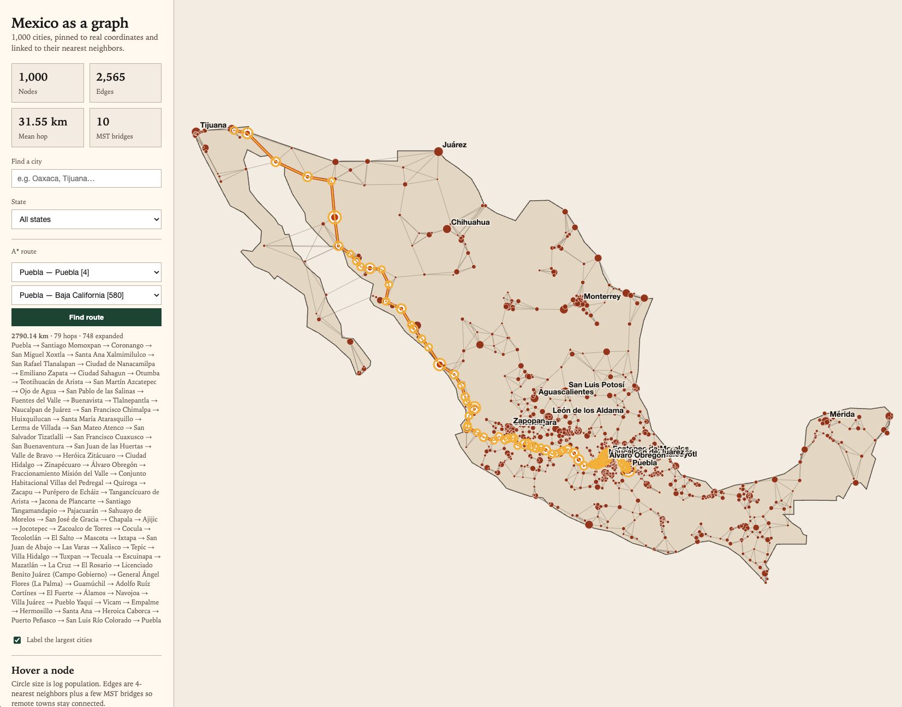
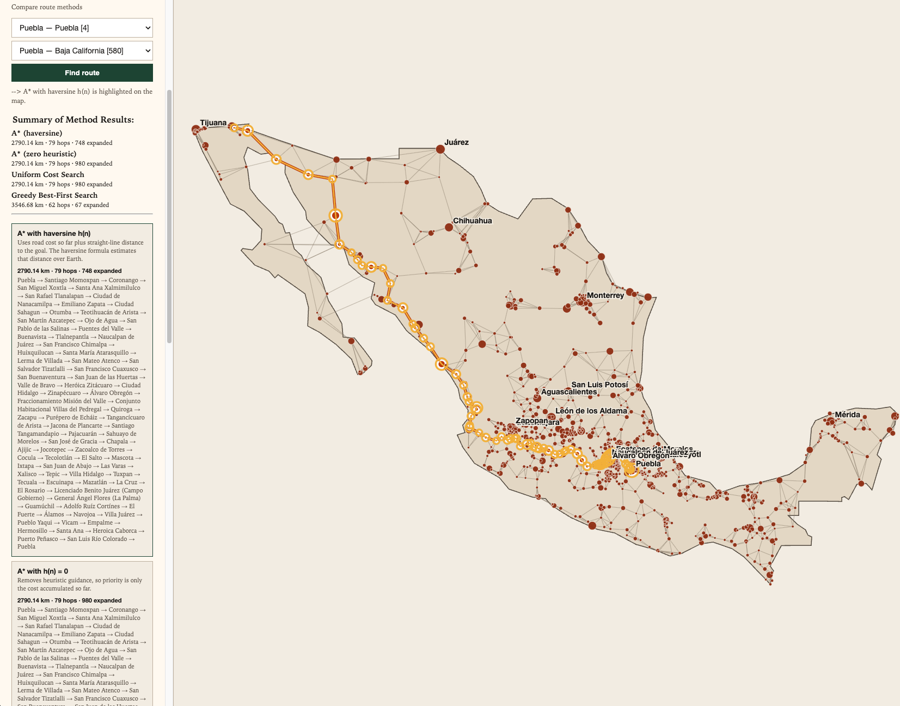

# Exercise 2

Results and asnwers

## CLI

The CLI currently is able to find the path from cities (if there is a registered connection between them in [mexico_cities_graph.json](../docs_from_teacher/mexico_map/mexico_cities_graph.json))

It was found that some city names could be repeated in different states, like:

- Puebla, Puebla
- Puebla, Baja California

So to prevent ambiguity it was proposed a state argument for start and goal.

|Arguments for the CLI|Description|Required/Optional|
|-|-|-|
|--from-city|Starting city name|Required|
|--from-state|State for an ambiguous starting city|Optional|
|--to-city|Goal city name|Required|
|--to-state|State for an ambiguous goal city|Optional|

### Running the script

Scripts are run inside [docs_from_teacher/mexico_map](../docs_from_teacher/mexico_map/) folder

Command:

```sh
# cd ../04_informed_search/docs_from_teacher/mexico_map
uv run find_route.py --from-city Puebla --from-state Puebla --to-city Puebla --to-state "Baja California"
```

```sh
Algorithm: A* search
Problem:   Puebla (Puebla) → Puebla (Baja California)
Heuristic: straight-line distance to Puebla (haversine)
Notice:    Origin 'Puebla' was disambiguated with state 'Puebla'.
Notice:    Destination 'Puebla' was disambiguated with state 'Baja California'.
Status:    success

===> START: Path
Path:      Puebla (Puebla) → Santiago Momoxpan (Puebla) → Coronango (Puebla) → San Miguel Xoxtla (Puebla) → Santa Ana Xalmimilulco (Puebla) → San Rafael Tlanalapan (Puebla) → Ciudad de Nanacamilpa (Tlaxcala) → Emiliano Zapata (Hidalgo) → Ciudad Sahagun (Hidalgo) → Otumba (México) → Teotihuacán de Arista (México) → San Martín Azcatepec (México) → Ojo de Agua (México) → San Pablo de las Salinas (México) → Fuentes del Valle (México) → Buenavista (México) → Tlalnepantla (México) → Naucalpan de Juárez (México) → San Francisco Chimalpa (Morelos) → Huixquilucan (México) → Santa María Atarasquillo (Morelos) → Lerma de Villada (México) → San Mateo Atenco (México) → San Salvador Tizatlalli (México) → San Francisco Cuaxusco (México) → San Buenaventura (México) → San Juan de las Huertas (México) → Valle de Bravo (México) → Heróica Zitácuaro (Michoacán) → Ciudad Hidalgo (Michoacán) → Zinapécuaro (Michoacán) → Álvaro Obregón (Michoacán) → Fraccionamiento Misión del Valle (Michoacán) → Conjunto Habitacional Villas del Pedregal (Michoacán) → Quiroga (Michoacán) → Zacapu (Michoacán) → Purépero de Echáiz (Michoacán) → Tangancícuaro de Arista (México) → Jacona de Plancarte (México) → Santiago Tangamandapio (Michoacán) → Pajacuarán (Michoacán) → Sahuayo de Morelos (Michoacán) → San José de Gracia (Michoacán) → Chapala (Jalisco) → Ajijic (Jalisco) → Jocotepec (Jalisco) → Zacoalco de Torres (Jalisco) → Cocula (Jalisco) → Tecolotlán (Jalisco) → El Salto (Jalisco) → Mascota (Jalisco) → Ixtapa (Jalisco) → San Juan de Abajo (Nayarit) → Las Varas (Nayarit) → Xalisco (Nayarit) → Tepic (Nayarit) → Villa Hidalgo (Nayarit) → Tuxpan (Nayarit) → Tecuala (Nayarit) → Escuinapa (Sinaloa) → Mazatlán (Sinaloa) → La Cruz (Sinaloa) → El Rosario (Sinaloa) → Licenciado Benito Juárez (Campo Gobierno) (Sinaloa) → General Ángel Flores (La Palma) (Sinaloa) → Guamúchil (Sinaloa) → Adolfo Ruíz Cortínes (Sinaloa) → El Fuerte (Sinaloa) → Álamos (Sonora) → Navojoa (Sonora) → Villa Juárez (Sonora) → Pueblo Yaqui (Sonora) → Vicam (Sonora) → Empalme (Sonora) → Hermosillo (Sonora) → Santa Ana (Sonora) → Heroica Caborca (Sonora) → Puerto Peñasco (Sonora) → San Luis Río Colorado (Sonora) → Puebla (Baja California)
===> END: Path

Depth:     79 roads
Cost:      2790.14 km

===> START: city & g,h,f
city                                      g       h       f
Puebla (Puebla)                             0.00 2276.62 2276.62
Santiago Momoxpan (Puebla)                  7.76 2269.08 2276.84
Coronango (Puebla)                         14.43 2262.47 2276.90
San Miguel Xoxtla (Puebla)                 19.63 2258.70 2278.33
Santa Ana Xalmimilulco (Puebla)            28.93 2249.60 2278.53
San Rafael Tlanalapan (Puebla)             41.51 2237.02 2278.53
Ciudad de Nanacamilpa (Tlaxcala)           65.07 2216.17 2281.24
Emiliano Zapata (Hidalgo)                  83.05 2203.03 2286.08
Ciudad Sahagun (Hidalgo)                   96.82 2191.48 2288.30
Otumba (México)                           117.61 2183.66 2301.27
Teotihuacán de Arista (México)            128.60 2176.63 2305.23
San Martín Azcatepec (México)             140.33 2168.51 2308.84
Ojo de Agua (México)                      144.29 2166.23 2310.52
San Pablo de las Salinas (México)         153.30 2161.00 2314.30
Fuentes del Valle (México)                159.25 2160.43 2319.68
Buenavista (México)                       163.45 2160.05 2323.50
Tlalnepantla (México)                     171.51 2163.51 2335.02
Naucalpan de Juárez (México)              179.78 2165.12 2344.90
San Francisco Chimalpa (Morelos)          191.42 2160.29 2351.71
Huixquilucan (México)                     200.67 2166.45 2367.12
Santa María Atarasquillo (Morelos)        213.62 2160.30 2373.92
Lerma de Villada (México)                 219.89 2160.37 2380.26
San Mateo Atenco (México)                 223.09 2160.59 2383.68
San Salvador Tizatlalli (México)          229.30 2156.93 2386.23
San Francisco Cuaxusco (México)           232.39 2154.29 2386.68
San Buenaventura (México)                 238.07 2150.51 2388.58
San Juan de las Huertas (México)          247.23 2145.87 2393.10
Valle de Bravo (México)                   286.82 2123.48 2410.30
Heróica Zitácuaro (Michoacán)             322.61 2087.69 2410.30
Ciudad Hidalgo (Michoacán)                357.83 2052.72 2410.55
Zinapécuaro (Michoacán)                   392.02 2019.58 2411.60
Álvaro Obregón (Michoacán)                414.57 2007.85 2422.42
Fraccionamiento Misión del Valle (Michoacán)  425.10 2006.70 2431.80
Conjunto Habitacional Villas del Pedregal (Michoacán)  446.21 2000.83 2447.04
Quiroga (Michoacán)                       469.25 1987.20 2456.45
Zacapu (Michoacán)                        502.11 1955.80 2457.91
Purépero de Echáiz (Michoacán)            526.84 1933.53 2460.37
Tangancícuaro de Arista (México)          547.92 1921.93 2469.85
Jacona de Plancarte (México)              560.75 1909.56 2470.31
Santiago Tangamandapio (Michoacán)        574.10 1900.70 2474.80
Pajacuarán (Michoacán)                    596.83 1878.00 2474.83
Sahuayo de Morelos (Michoacán)            613.83 1873.19 2487.02
San José de Gracia (Michoacán)            646.73 1858.95 2505.68
Chapala (Jalisco)                         685.12 1821.33 2506.45
Ajijic (Jalisco)                          691.79 1816.55 2508.34
Jocotepec (Jalisco)                       710.07 1806.75 2516.82
Zacoalco de Torres (Jalisco)              725.97 1802.71 2528.68
Cocula (Jalisco)                          756.48 1774.45 2530.93
Tecolotlán (Jalisco)                      786.19 1774.64 2560.83
El Salto (Jalisco)                        835.61 1734.76 2570.37
Mascota (Jalisco)                         872.47 1699.79 2572.26
Ixtapa (Jalisco)                          920.76 1657.33 2578.09
San Juan de Abajo (Nayarit)               931.79 1649.21 2581.00
Las Varas (Nayarit)                       972.83 1619.73 2592.56
Xalisco (Nayarit)                        1011.72 1610.55 2622.27
Tepic (Nayarit)                          1018.23 1605.57 2623.80
Villa Hidalgo (Nayarit)                  1061.46 1563.94 2625.40
Tuxpan (Nayarit)                         1084.81 1542.03 2626.84
Tecuala (Nayarit)                        1138.10 1492.06 2630.16
Escuinapa (Sinaloa)                      1196.51 1433.83 2630.34
Mazatlán (Sinaloa)                       1274.71 1358.94 2633.65
La Cruz (Sinaloa)                        1365.90 1268.19 2634.09
El Rosario (Sinaloa)                     1413.34 1220.76 2634.10
Licenciado Benito Juárez (Campo Gobierno) (Sinaloa) 1471.08 1163.02 2634.10
General Ángel Flores (La Palma) (Sinaloa) 1492.38 1141.89 2634.27
Guamúchil (Sinaloa)                      1575.14 1060.13 2635.27
Adolfo Ruíz Cortínes (Sinaloa)           1649.97  992.28 2642.25
El Fuerte (Sinaloa)                      1725.28  944.26 2669.54
Álamos (Sonora)                          1799.66  873.44 2673.10
Navojoa (Sonora)                         1850.37  835.46 2685.83
Villa Juárez (Sonora)                    1890.05  804.98 2695.03
Pueblo Yaqui (Sonora)                    1921.80  773.27 2695.07
Vicam (Sonora)                           1962.80  732.29 2695.09
Empalme (Sonora)                         2025.04  672.32 2697.36
Hermosillo (Sonora)                      2152.90  568.15 2721.05
Santa Ana (Sonora)                       2313.40  460.09 2773.49
Heroica Caborca (Sonora)                 2414.78  365.65 2780.43
Puerto Peñasco (Sonora)                  2562.17  220.55 2782.72
San Luis Río Colorado (Sonora)           2734.24   55.90 2790.14
Puebla (Baja California)                 2790.14    0.00 2790.14
===> END: city & g,h,f

Expanded:  748 nodes
Generated: 3837 nodes
Frontier:  max size 76
```

You can see that the formatting process of adjacent cities in [graph](../docs_from_teacher/mexico_map/graph.py)
considered to create a json with city IDs and a nested JSON with their particular destination/neighbor path cost in kms

```python
# .....
payload = json.loads(graph_path.read_text(encoding="utf-8"))

for edge in payload["edges"]:
    source, target = edge["source"], edge["target"]
    self._adj[source][target] = edge["km"]
    self._adj[target][source] = edge["km"]
# .....
```

then, to get the heuristic using the [haversine](../docs_from_teacher/mexico_map/heuristics.py) is easy

## HTML

To be able to draw the travel path in the html, some changes where made to UI and the

- translate python code to javascript
- copy and paste json of mexican cities (to have it all in the same html file)
- change styles to remark the value
- edit form to add start and goal values
  - by ID, this is, each city with its state is displayed in a selector to prevent ambiguity
- UI with the selector, comes with several advantages
  - ambiguity is gone since each city is displayed with each id (just for reference) and its corresponding state
  - typos prevented, by spanish explicit accents or difficult names to write

just drag and drop the [mexico_map_complete.html](../docs_from_teacher/mexico_map/mexico_map_complete.html) in your web browser

Example:



### Optional challenge

Updates in the html file ([mexico_map_complete.html](../docs_from_teacher/mexico_map/mexico_map_complete.html))

- Added methods to compare:
  - A start search with h= 0
  - Uniform Cost Search
  - Greedy
- UI has a quick summary look up to compare some details from each method
- UI has a card for each method with the title, details of algorithm/method and the found path


