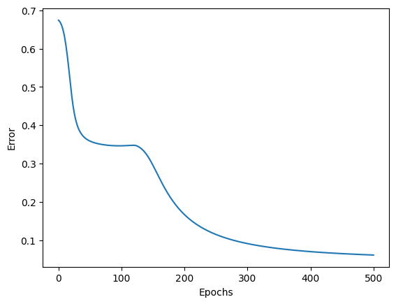
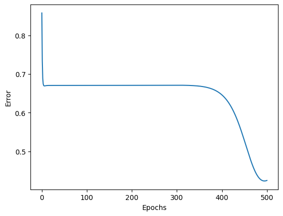
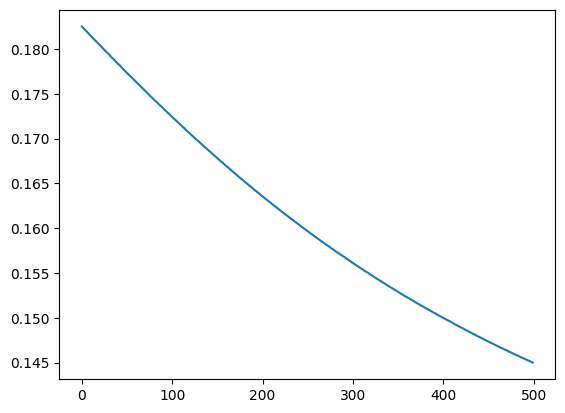
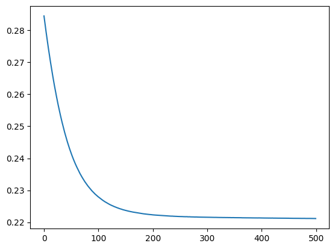
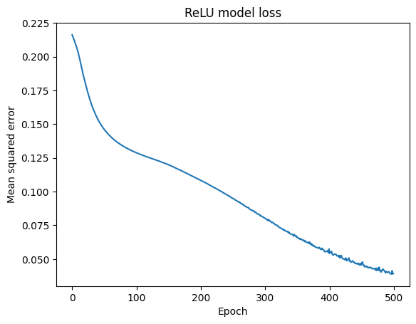
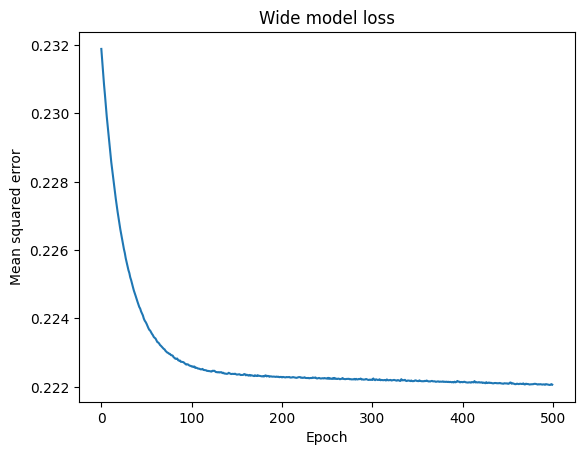
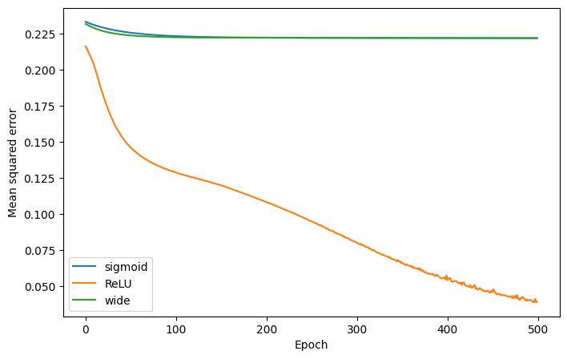

# More layers in the Multilayer Perceptron (Iris)

Results for the [exercise 01](https://github.com/victoruccetina/inteligencia-artificial/blob/main/Perceptr%C3%B3n%20multicapa/Ejercicios/ejercicio-01.md)

## Running Multilayer Perceptron NoteBook

file: [04 Multilayer perceptron updated.ipynb](../docs_from_teacher/Notebooks/04%20Multilayer%20perceptron%20updated.ipynb)
updates: All the outputs I had by running it my local are saved in the file uploaded in github

Curve of error, after running it for the first time:



Value of error at the end of the 500 epochs: `0.05633` approx.

Training time:

```sh
2.13150 seconds
```

### Second run with 2 extra hidden layers

In my case the error value decreased

- Probably I didn't make the proper code changes, but I tried to followed what I saw in the notebook

Curve of error, after running it for the first time:



Value of error at the end of the 500 epochs: `0.0.424463633` approx.

And the training time increased like 2x

Training time:

```sh
4.07216 seconds
```

#### Conclusion

The shape of the curve of the error was different after the new extra layers

I see that at the beginning the error decreases faster but during a long time there is a flat slope, like the errors stayed the same for a long amount of iterations, but before finishing there is another fast decrease

I am not sure why the error stayed the same during a big portion of the shape, but adding 2 more hidden layers helped to decrease the error

## Running Keras Multilayer Perceptron NoteBook

file: [05 Keras - multilayer perceptron - iris updated.ipynb](../docs_from_teacher/Notebooks/05%20Keras%20-%20multilayer%20perceptron%20-%20iris%20updated.ipynb)
updates: All the outputs I had by running it my local are saved in the file uploaded in github

Curve of loss, after running it for the first time:



Value of error at the end of the 500 epochs: `0.14501` approx.

Summary function result:

command:

```python
model.summary()
```

result:

```sh
Model: "sequential"
┏━━━━━━━━━━━━━━━━━━━━━━━━━━━━━━━━━┳━━━━━━━━━━━━━━━━━━━━━━━━┳━━━━━━━━━━━━━━━┓
┃ Layer (type)                    ┃ Output Shape           ┃       Param # ┃
┡━━━━━━━━━━━━━━━━━━━━━━━━━━━━━━━━━╇━━━━━━━━━━━━━━━━━━━━━━━━╇━━━━━━━━━━━━━━━┩
│ layer1 (Dense)                  │ (None, 3)              │            15 │
├─────────────────────────────────┼────────────────────────┼───────────────┤
│ layer2 (Dense)                  │ (None, 3)              │            12 │
└─────────────────────────────────┴────────────────────────┴───────────────┘
 Total params: 27 (108.00 B)
 Trainable params: 27 (108.00 B)
 Non-trainable params: 0 (0.00 B)
```

Training time:

```sh
2.13150 seconds
```

Example of a prediction:

command:

```python
model.predict(np.array([[3,3,1,1]]))
```

result:

```sh
1/1 ━━━━━━━━━━━━━━━━━━━━ 0s 41ms/step
array([[0.6211798 , 0.25208354, 0.20638402]], dtype=float32)
```

### Second run with 2 extra hidden layers

In my case, the error increased

- Probably I didn't make the proper code changes, but I tried to followed what I saw in the notebook

Curve of loss, after running it for the second time:



Value of error at the end of the 500 epochs: `0.22116` approx.

Summary function result:

command:

```python
model.summary()
```

result:

```sh
Model: "sequential_2"
┏━━━━━━━━━━━━━━━━━━━━━━━━━━━━━━━━━┳━━━━━━━━━━━━━━━━━━━━━━━━┳━━━━━━━━━━━━━━━┓
┃ Layer (type)                    ┃ Output Shape           ┃       Param # ┃
┡━━━━━━━━━━━━━━━━━━━━━━━━━━━━━━━━━╇━━━━━━━━━━━━━━━━━━━━━━━━╇━━━━━━━━━━━━━━━┩
│ layer1 (Dense)                  │ (None, 3)              │            15 │
├─────────────────────────────────┼────────────────────────┼───────────────┤
│ layer2 (Dense)                  │ (None, 3)              │            12 │
├─────────────────────────────────┼────────────────────────┼───────────────┤
│ layer3 (Dense)                  │ (None, 3)              │            12 │
├─────────────────────────────────┼────────────────────────┼───────────────┤
│ layer4 (Dense)                  │ (None, 3)              │            12 │
└─────────────────────────────────┴────────────────────────┴───────────────┘
 Total params: 51 (204.00 B)
 Trainable params: 51 (204.00 B)
 Non-trainable params: 0 (0.00 B)
```

Training time increased like 3x:

```sh
7.86163 seconds
```

Example of a prediction:

command:

```python
model.predict(np.array([[3,3,1,1]]))
```

result:

```sh
1/1 ━━━━━━━━━━━━━━━━━━━━ 0s 21ms/step
array([[0.34116313, 0.33768427, 0.3353205 ]], dtype=float32)
```

#### Conclusion

At the end the curve drastically decreased with the extra 2 layers, but the error increased in my case

I am not sure if the error is because of the internal algorithm, but at least I can deduce that with more layers the error converges faster

## Optional challenge

### Relu and softmax

I created a model like this:

```python
model_relu = keras.Sequential(
    [
        keras.Input(shape=(4,)),
        layers.Dense(3, activation="relu", name="relu_layer1"),
        layers.Dense(3, activation="relu", name="relu_layer2"),
        layers.Dense(3, activation="relu", name="relu_layer3"),
        layers.Dense(3, activation="softmax", name="relu_output"),
    ],
    name="model_relu",
)
```

Model summary:

```python
model_relu.summary()
```

```sh
Model: "model_relu"

┏━━━━━━━━━━━━━━━━━━━━━━━━━━━━━━━━━┳━━━━━━━━━━━━━━━━━━━━━━━━┳━━━━━━━━━━━━━━━┓
┃ Layer (type)                    ┃ Output Shape           ┃       Param # ┃
┡━━━━━━━━━━━━━━━━━━━━━━━━━━━━━━━━━╇━━━━━━━━━━━━━━━━━━━━━━━━╇━━━━━━━━━━━━━━━┩
│ relu_layer1 (Dense)             │ (None, 3)              │            15 │
├─────────────────────────────────┼────────────────────────┼───────────────┤
│ relu_layer2 (Dense)             │ (None, 3)              │            12 │
├─────────────────────────────────┼────────────────────────┼───────────────┤
│ relu_layer3 (Dense)             │ (None, 3)              │            12 │
├─────────────────────────────────┼────────────────────────┼───────────────┤
│ relu_output (Dense)             │ (None, 3)              │            12 │
└─────────────────────────────────┴────────────────────────┴───────────────┘
 Total params: 51 (204.00 B)
 Trainable params: 51 (204.00 B)
 Non-trainable params: 0 (0.00 B)
```

Training time (with relu): `6.02894 seconds`

I ran the the notebook several times and I got different shapes and error values

- I am not sure why the big differences in shapes, probably due to the random first values

Shape of last run:



Value of last loss for this shape: `0.03919`

### Model 4x8x8x8x3

I created a model like this one:

```python
# 4 x 8 x 8 x 8 x 3
model_wide = keras.Sequential(
    [
        keras.Input(shape=(4,)),
        layers.Dense(8, activation="sigmoid", name="wide_layer1"),
        layers.Dense(8, activation="sigmoid", name="wide_layer2"),
        layers.Dense(8, activation="sigmoid", name="wide_layer3"),
        layers.Dense(3, activation="sigmoid", name="wide_output"),
    ],
    name="model_wide",
)
```

Model summary:

```python
model_wide.summary()
```

```sh
Model: "model_wide"
┏━━━━━━━━━━━━━━━━━━━━━━━━━━━━━━━━━┳━━━━━━━━━━━━━━━━━━━━━━━━┳━━━━━━━━━━━━━━━┓
┃ Layer (type)                    ┃ Output Shape           ┃       Param # ┃
┡━━━━━━━━━━━━━━━━━━━━━━━━━━━━━━━━━╇━━━━━━━━━━━━━━━━━━━━━━━━╇━━━━━━━━━━━━━━━┩
│ wide_layer1 (Dense)             │ (None, 8)              │            40 │
├─────────────────────────────────┼────────────────────────┼───────────────┤
│ wide_layer2 (Dense)             │ (None, 8)              │            72 │
├─────────────────────────────────┼────────────────────────┼───────────────┤
│ wide_layer3 (Dense)             │ (None, 8)              │            72 │
├─────────────────────────────────┼────────────────────────┼───────────────┤
│ wide_output (Dense)             │ (None, 3)              │            27 │
└─────────────────────────────────┴────────────────────────┴───────────────┘
 Total params: 211 (844.00 B)
 Trainable params: 211 (844.00 B)
 Non-trainable params: 0 (0.00 B)
```

Training time: `6.04233 seconds`

Shape of loss:



Value of last loss: `0.22206`

### Conclusion

the best performance was the relu and softmax combination, as you can see in the next image:



### Print errors in Multi Layer perceptron

|Index of the printed error|2 Layers|4 layers|difference (layer of 2 - layer of 4)|
|-|-|-|-|
|0|0.8049752|0.85815271|-0.05317751000000004|
|50|0.32976256|0.67048983|-0.34072726999999997|
|100|0.22432671|0.67051992|-0.44619321|
|150|0.14627724|0.67058603|-0.5243087900000001|
|200|0.10857529|0.67071722|-0.56214193|
|250|0.08888656|0.67094915|-0.58206259|
|300|0.07731745|0.6710808|-0.59376335|
|350|0.06990098|0.66869395|-0.59879297|
|400|0.06484444|0.64606626|-0.58122182|
|450|0.06124098|0.52766603|-0.46642505|
|500|0.05858873|0.42446363|-0.3658749|
