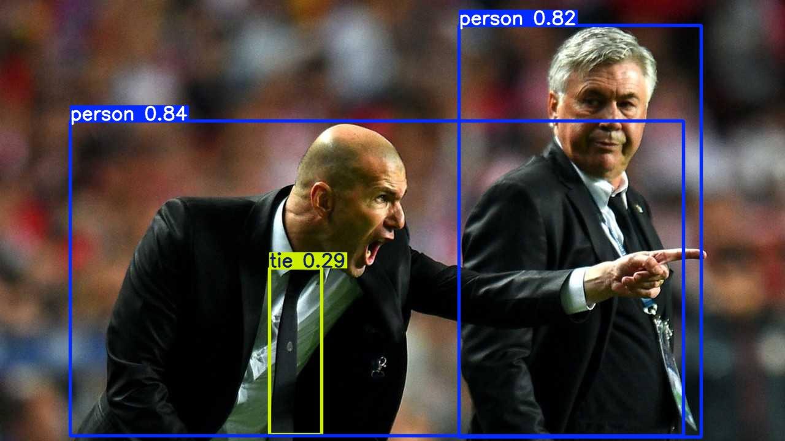
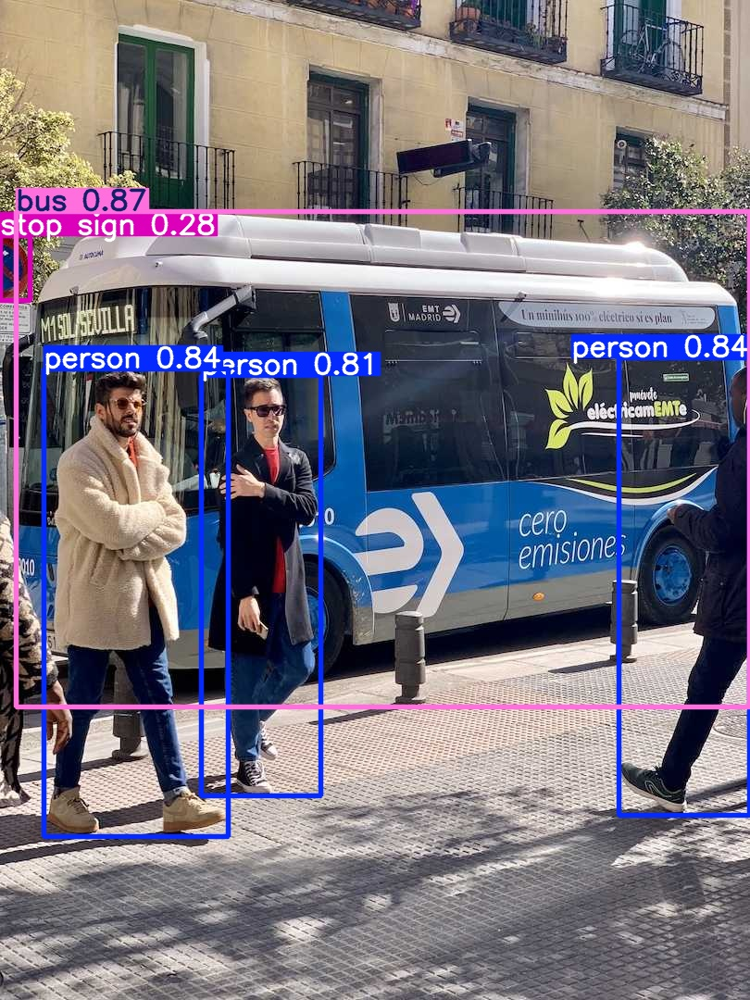
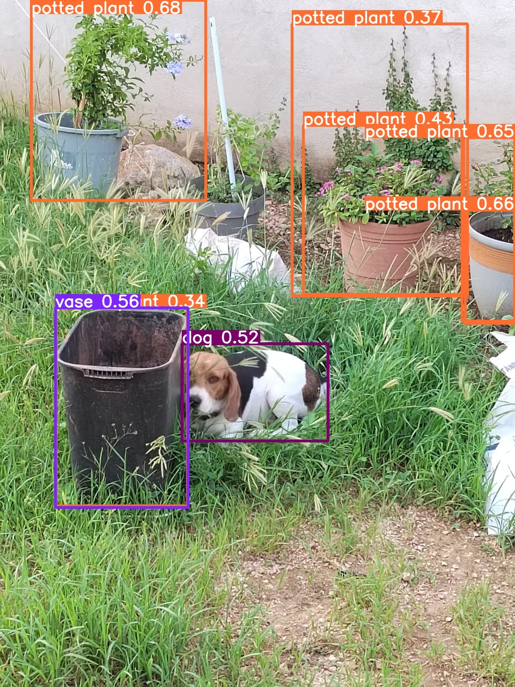
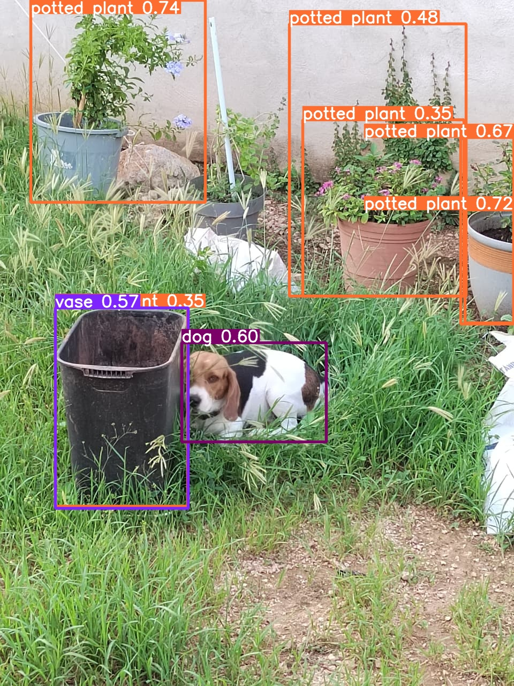
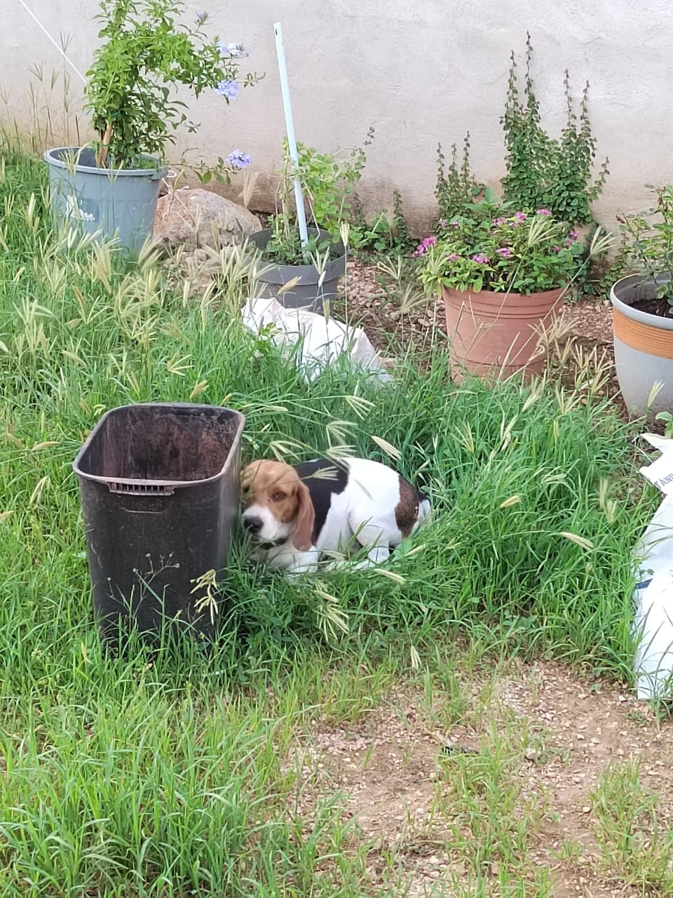
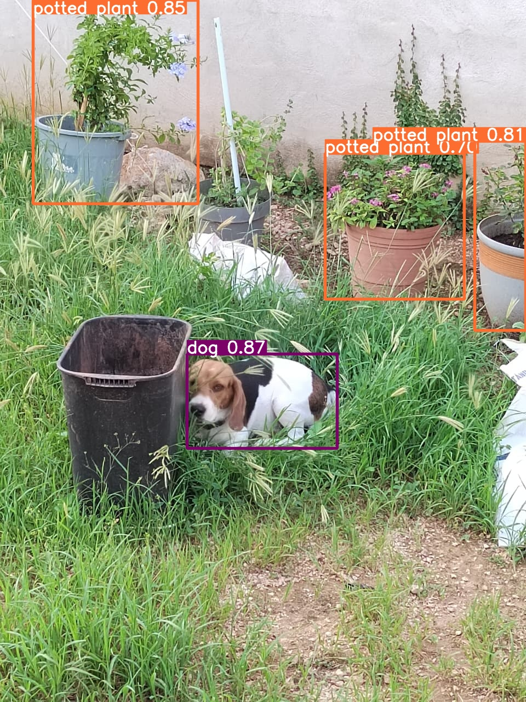

# Exercise 1

## Original notebook run

- [notebook with output cells](../docs_from_teacher/Notebooks/13%20YOLO%20ultralytics.ipynb)

output of run:
zidane with boxes and predictions

bus with boxes and predictions

## run with my photo

- [notebook with output cells](../docs_from_teacher/Notebooks/13%20YOLO%20ultralytics%20my%20photo.ipynb)
output of run

prediction with yolo

prediction with COCO

## conclusion

- YOLO detected 2 persons and a tie
- in my photo there was a potted plant that was not detected, probably the shape could be put of the yolo specifications
- also there was a kind of plant that was not in a pot, but I think yolo consider it since it cannot fully determine deepness in a photo, like there was a pot in front and probably that made it think both plants were in pots
- Both CLI and `model(...)` cells were good at prediction
- The only thing it was not properly detected was a trash can that was labeled as a vase instead

## Optional challenge

prediction with yolo and `conf=0.7`

as you can see, there was no object detected

prediction with yolo and `model=yolov8s.pt`

as you can see, there is less objects labeled but with a better prediction

prediction with yolo for video

it is difficult to see a wrong label in the video, but from the output in the cell of the notebook I saw there was a frame were it labeled the left dog as a bird
