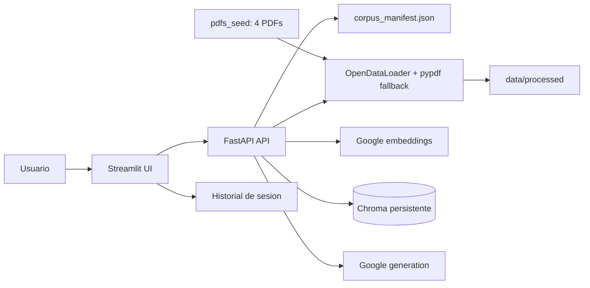

# Proyecto final: Habanero RAG

Este proyecto es un MVP educativo de RAG para consultar información agrícola sobre chile habanero. La interfaz está construida con Streamlit, la API con FastAPI, la recuperación vectorial con ChromaDB y los modelos de Google AI.

## Corpus inicial

El corpus incluido en [`pdfs_seed/`](./pdfs_seed/) contiene estos cuatro PDF:

- `2025_Manual-fertilizacion_GRC.pdf`
- `Agenda_Tecnica_Yucatan_2017.pdf`
- `Ficha-Tecnica-Chile-Hab_Balche.pdf`
- `Ficha-Tecnica-Chile-Hab_Kisin.pdf`

Estos cuatro documentos se conservan intencionalmente para este MVP porque, en conjunto, son extensos, coherentes y contienen varios miles de palabras sobre fertilización, cultivo, variedades y manejo del chile habanero. Esto es una excepción práctica a la guía general de usar cinco documentos para la actividad: no se agrega un quinto PDF porque el corpus actual ya ofrece evidencia suficiente y consistente para la demostración.

La indexación no ocurre automáticamente al iniciar los servicios. En la interfaz se debe pulsar **Indexar corpus inicial**. La API también permite solicitar la misma operación con `POST /ingest` usando `action=corpus`.

La pestaña **Corpus** muestra el estado individual de los cuatro PDF (`loaded`, `pending`, `failed` o `missing`), sus fragmentos indexados y los errores de procesamiento. La misma información está disponible en `GET /corpus/status`.

### Algunos pdfs que se podrían relacionar

Se puede descargar este pdf y cargarlo en la interfaz como prueba

- Ficha-UPS-Habanero | <https://www.cicy.mx/Documentos/CICY/quienes-somos/2016/Ficha-UPS-Habanero.pdf>

## Requisitos

- Python 3.12.
- [`uv`](https://docs.astral.sh/uv/).
- Docker y Docker Compose para ejecutar los dos servicios.
- Una clave de Google AI.

## Configuración local

Desde este directorio (`final_project/`), sincroniza el entorno bloqueado:

```bash
uv sync --locked
```

Crea el archivo local de variables a partir de la plantilla:

```bash
cp .env.example .env
```

Obtén `GOOGLE_API_KEY` en [Google AI Studio](https://aistudio.google.com/api-keys) y completa `.env`:

```dotenv
GOOGLE_API_KEY=pega_aqui_tu_clave_local
```

La aplicación lee `GOOGLE_API_KEY`, que es el nombre principal usado por
Compose y `.env.example`. También acepta `GEMINI_API_KEY` como alias de
compatibilidad si `GOOGLE_API_KEY` no está definido.

La clave es un secreto local. No la escribas en el código, capturas de pantalla, commits ni archivos compartidos. `.env`, los textos generados y la persistencia de Chroma están excluidos de Git.

La configuración predeterminada es:

| Variable | Valor | Uso |
| --- | --- | --- |
| `GOOGLE_EMBEDDING_MODEL` | `gemini-embedding-001` | Embeddings de documentos y preguntas |
| `GOOGLE_GENERATION_MODEL` | `gemini-3.1-flash-lite` | Generación de respuestas en español; se puede cambiar por otro modelo compatible |
| `CHUNK_SIZE` | `300` | Palabras por fragmento |
| `CHUNK_OVERLAP` | `60` | Palabras compartidas entre fragmentos |
| `TOP_K` | `4` | Evidencias recuperadas por defecto |
| `MIN_SCORE` | `0.35` | Umbral mínimo de evidencia |
| `MODEL_RETRY_ATTEMPTS` | `5` | Intentos ante errores transitorios de Google |
| `MODEL_RETRY_BACKOFF_SECONDS` | `5` | Espera inicial entre reintentos |
| `EMBEDDING_BATCH_SIZE` | `32` | Fragmentos enviados por petición de embeddings |
| `QUERY_TIMEOUT_SECONDS` | `60` | Timeout de consultas de la UI; se recomienda un máximo de 120 segundos |
| `CHROMA_PATH` | `./chroma` | Persistencia del índice vectorial |

El mismo modelo de embeddings se usa para indexar los fragmentos y para buscar preguntas. Si la mejor evidencia tiene una puntuación menor que `MIN_SCORE`, o no hay corpus indexado, la API se abstiene: devuelve un mensaje en español y no llama al modelo de generación.

La pestaña **Configuracion** permite ajustar estos valores por consulta sin modificar el entorno: `top_k` entre 2 y 10, y `min_score` entre 0.10 y 0.90 en pasos de 0.05. La pestaña **Consulta** usa la selección vigente y la pestaña **Corpus** permite revisar o volver a indexar los cuatro PDF iniciales.

## Ejecución con Docker Compose

Con `.env` configurado, ejecuta desde `final_project/`:

```bash
docker-compose build
docker-compose up
```

Compose valida que `GOOGLE_API_KEY` no esté vacía antes de iniciar la API. Si
falta la clave, copia `.env.example` a `.env`, agrega la clave de Google AI
Studio y vuelve a ejecutar `docker-compose up`.

Para dejar los servicios en segundo plano usa `docker-compose up -d`. Las URLs son:

- Streamlit: <http://localhost:8501>
- Documentación interactiva de FastAPI: <http://localhost:8000/docs>
- Estado de la API: <http://localhost:8000/health>

Detén los servicios con:

```bash
docker-compose down
```

Para borrar Chroma, los textos procesados y reconstruir el corpus inicial desde cero:

```bash
./scripts/reset_and_rebuild.sh
```

El volumen montado `chroma/` conserva el índice y `data/processed/` conserva los textos extraídos, sus metadatos de páginas y los manifiestos de progreso al detener o recrear los contenedores.

## Flujo de uso

1. Abre <http://localhost:8501>.
2. Revisa la pestaña **Corpus** para confirmar que están presentes los cuatro PDF.
3. Pulsa **Indexar corpus inicial** y espera el resultado de documentos y fragmentos procesados.
4. Ajusta `top_k` o `min_score` en **Configuracion** si necesitas cambiar el nivel de recuperación.
5. Escribe una pregunta en español, por ejemplo: `¿Cómo se recomienda fertilizar el chile habanero?`.
6. Pulsa **Consultar**. La respuesta muestra citas numeradas `[1]`, `[2]` y sus fuentes, fragmentos y puntuaciones.
7. Para ampliar el corpus, carga archivos PDF, Markdown (`.md` o `.markdown`) o texto plano (`.txt`) y pulsa **Cargar documentos**.

La carga acepta varios archivos y los procesa mediante `POST /ingest`. Una pregunta se envía a `POST /query`; también se puede probar ambos endpoints desde <http://localhost:8000/docs>. La UI solo se comunica con FastAPI: no accede directamente a Google AI ni a ChromaDB.

## Funcionalidades opcionales implementadas

- **Filtro por fuente:** en la pestaña **Consulta** se puede seleccionar un documento. La API también acepta `source` en `POST /query` para recuperar únicamente chunks de ese archivo.
- **Borrado individual:** `DELETE /documents/{source}` elimina los chunks de una fuente sin tocar el resto de la colección.
- **Reindexación individual:** `POST /documents/{source}/reindex` borra y vuelve a indexar un documento del corpus o un upload, sin reconstruir toda la colección. Para uploads reutiliza la extracción cacheada.
- **Histórico de preguntas:** la pestaña **Historial** conserva las preguntas y respuestas de la sesión actual de Streamlit.
- **Docker Compose:** `docker-compose.yml` levanta un servicio FastAPI (`api`) y otro Streamlit (`ui`), con Chroma y artefactos procesados persistentes.

## Procesamiento de documentos

Para un PDF, la API usa primero `opendataloader-pdf` mediante su API de Python. La imagen de Docker instala Java 21 y el paquete OpenDataLoader; si la extracción falla, usa `pypdf` como fallback. El texto extraído se guarda como UTF-8 en `data/processed/` para poder inspeccionarlo. Los archivos Markdown y texto se leen directamente y también quedan representados en el área de datos procesados. Los PDF que no contienen texto extraíble producen un error visible por archivo.

Cada documento se divide en fragmentos de 300 palabras con un solapamiento de 60 palabras por defecto. El hash estable de la fuente evita crear duplicados al indexar de nuevo el mismo archivo. Cuando un documento ya está completo, la API salta la extracción, los embeddings y la escritura en Chroma. Si una cuota interrumpe la indexación, cada lote exitoso queda guardado y el siguiente intento continúa únicamente con los fragmentos pendientes.

Los textos extraídos se cachean en `data/processed/` por hash, junto con sus metadatos de páginas. `corpus_manifest.json` conserva el estado de los PDF iniciales y `ingestion_manifest.json` conserva el estado de los documentos cargados. La pestaña **Corpus** muestra el progreso parcial como `indexados/total`. Ante un error de cuota, espere unos minutos y pulse de nuevo la acción de indexación; no se volverán a consumir embeddings ya guardados.

Las llamadas a embeddings y generación reintentan los errores transitorios de servicio ocupado o límite de tasa con espera exponencial y respetan `Retry-After` cuando Google lo devuelve. Los embeddings se envían en lotes para reducir el riesgo de exceder límites por petición. Si los intentos se agotan, la UI muestra también la causa final recibida de Google. Las preguntas y respuestas se conservan en la pestaña **Historial** durante la sesión actual de Streamlit.

La UI usa un timeout de `300` segundos para cargar o reindexar documentos. Las consultas usan `60` segundos por defecto y pueden ajustarse con `QUERY_TIMEOUT_SECONDS`; se recomienda no superar `120` segundos para evitar esperas excesivas en la interfaz.

## Estructura



## Pruebas y verificación

Ejecuta las pruebas y la comprobación de sintaxis con el entorno bloqueado:

```bash
uv sync --locked
uv run pytest -q
uv run python -m compileall app ui
```

Las pruebas cubren extracción y fallback de PDF, fragmentación, persistencia y deduplicación de Chroma, endpoints de salud/indexación/consulta, abstención, errores de la UI y configuración de Docker. Las pruebas automatizadas usan dobles para no necesitar una clave real; la demostración manual sí requiere `GOOGLE_API_KEY`.

## Evidencias

Consulta [`evidence/README.md`](./evidence/README.md) para la lista de capturas y comprobaciones manuales requeridas. Las evidencias deben mostrar respuestas citadas, la consulta equivalente en `/docs`, una abstención fuera de dominio y la persistencia tras reiniciar, sin revelar la clave ni incluir secretos en el repositorio.
