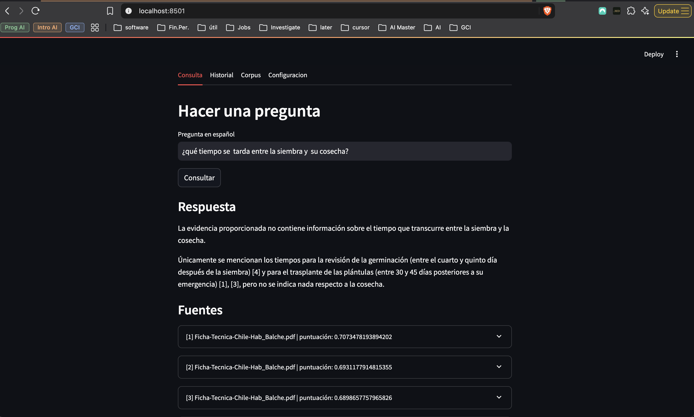
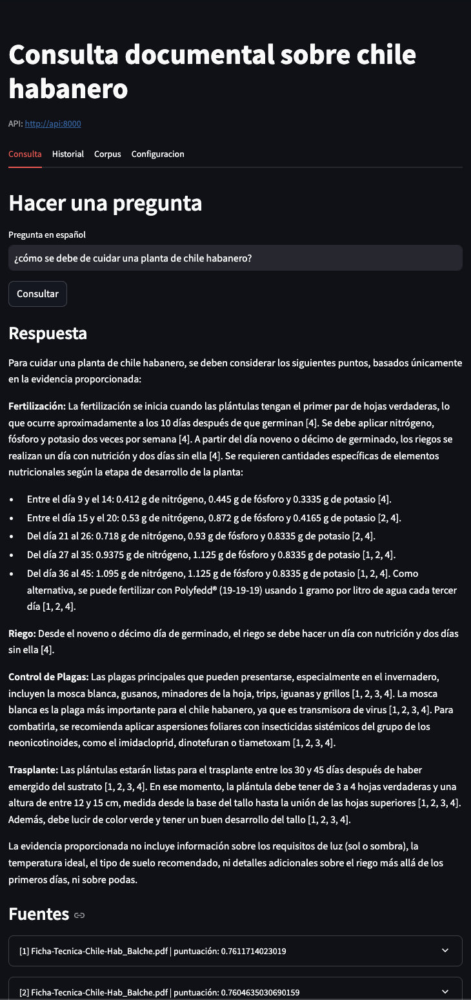
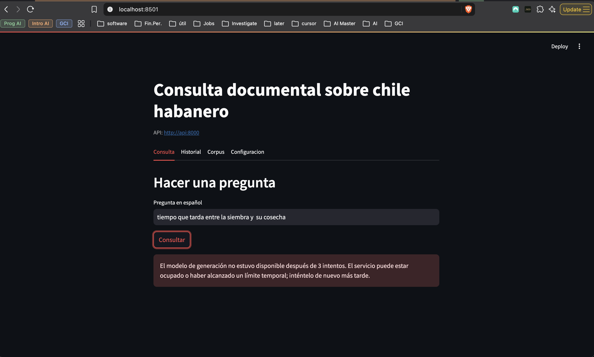
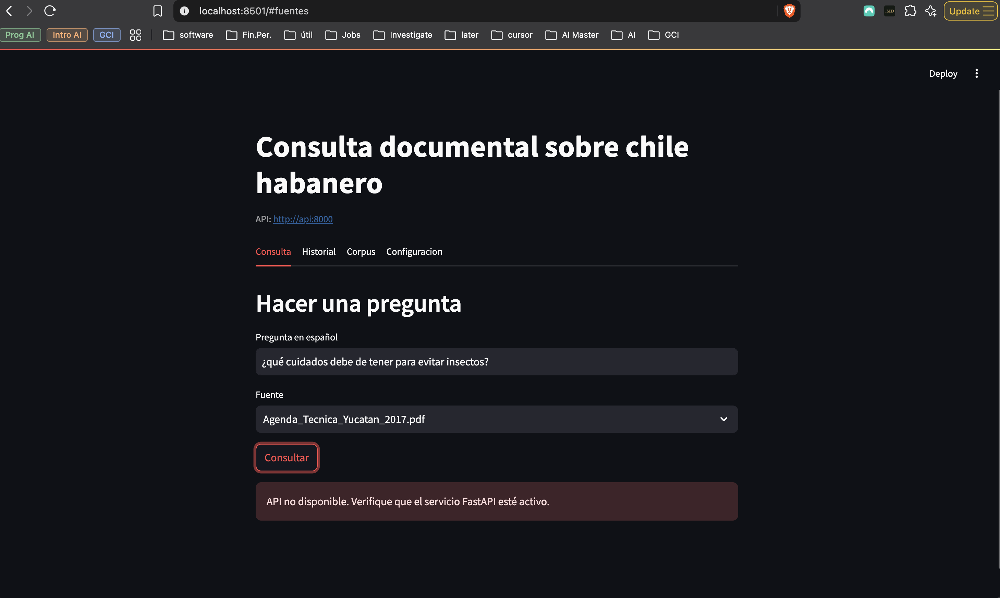
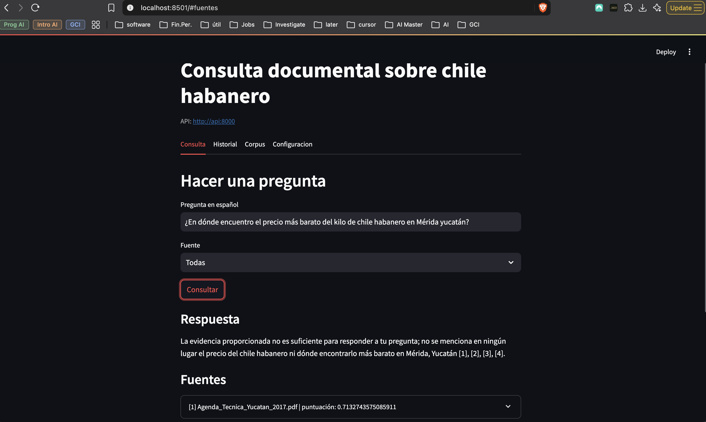
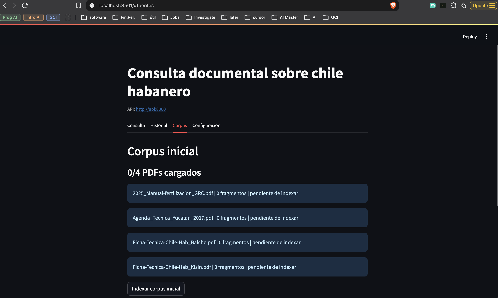
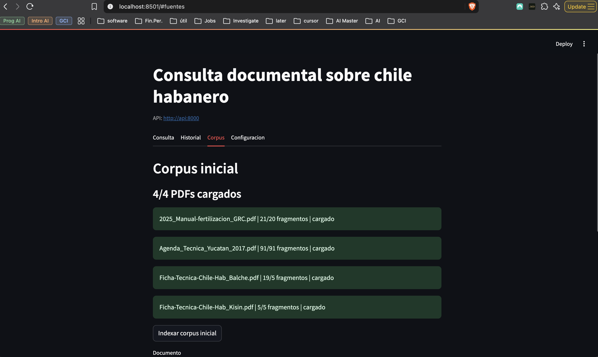
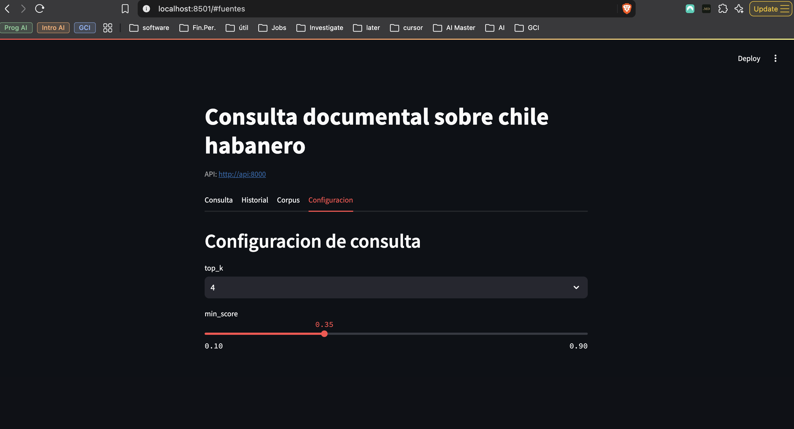
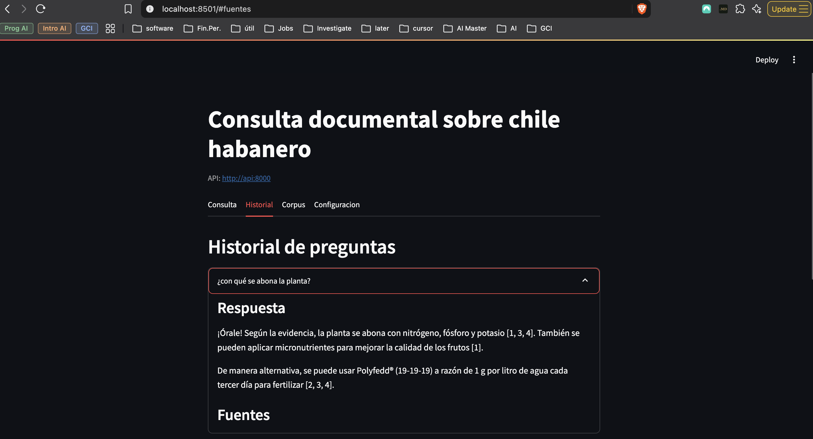
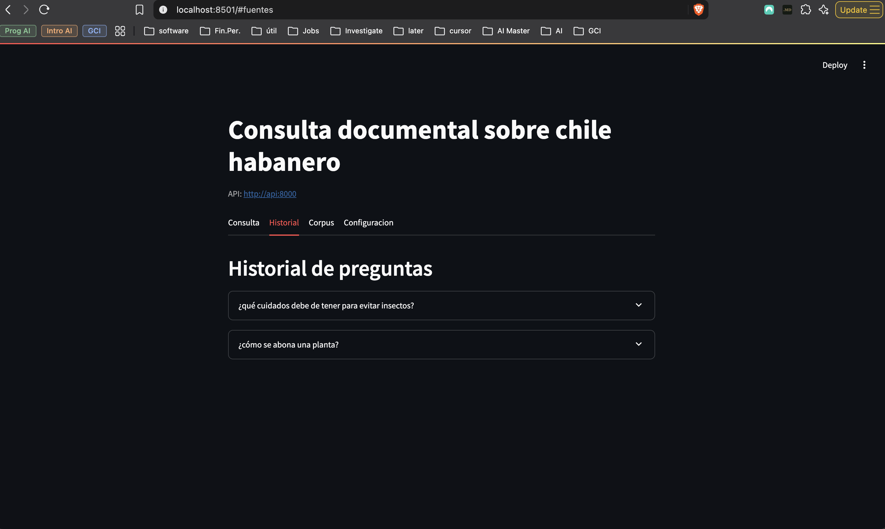

# Evidences

Screenshots of the evidences

The idea is that user can make any questions related to "cuidado y siembra de chile habanero"

example of answers:

CAUTION: Rate limit can be applied due to your license or plan:

CAUTION: Time out also could happen from the UI waiting for the backend response due to the LLM response duration.

Example of valid questions:

- ¿cómo se debe de cuidar una planta de chile habanero?
- ¿qué cuidados debe de tener para evitar insectos?
- ¿cómo se abona una planta?

Example of INVALID questions:

- ¿En dónde encuentro el precio más barato del kilo de chile habanero en Mérida yucatán?

## Config and corpus

Corpus section

config section

history section

